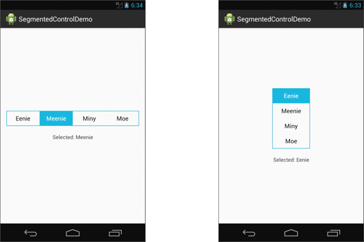

# SegmentedControl

SegmentedControl is a holo-themed, touch-friendly alternative to the radio control in Android. This control is similar to UISegmentedControl in iOS.



## Installation

- Clone or download the repository
- Import the `SegmentedControl/SegmentedControl` library project into the Android IDE
- Go to your project's properties and add `SegmentedControl` as a library
- Open your project's `styles.xml` file and add an entry for `segmentedControlButtonStyle` as shown below:

```xml
<style name="AppTheme" parent="...">
    ...
    <item name="segmentedControlButtonStyle">@style/SegmentedControlButton</item>
</style>
```

(This last step is necessary due to [Android issue 12683](https://code.google.com/p/android/issues/detail?id=12683).)

## Usage

SegmentedControl can be used as a drop-in replacement for RadioGroup.

Sample layout XML:
```xml
<org.nairteashop.SegmentedControl
    android:id="@+id/segmented_control"
    android:layout_width="match_parent"
    android:layout_height="wrap_content"
    android:orientation="horizontal"
>
    <org.nairteashop.SegmentedControlButton android:id="@+id/opt_1" android:text="@string/label_1" />
    <org.nairteashop.SegmentedControlButton android:id="@+id/opt_2" android:text="@string/label_2" />
</org.nairteashop.SegmentedControl>
```

## Credits

SegmentedControl was created by [Arun Nair](http://nairteashop.org), based on code by [Benjamin Ferrari](https://github.com/bookwormat/segcontrol). If you use this code in your project, attribution is appreciated.
